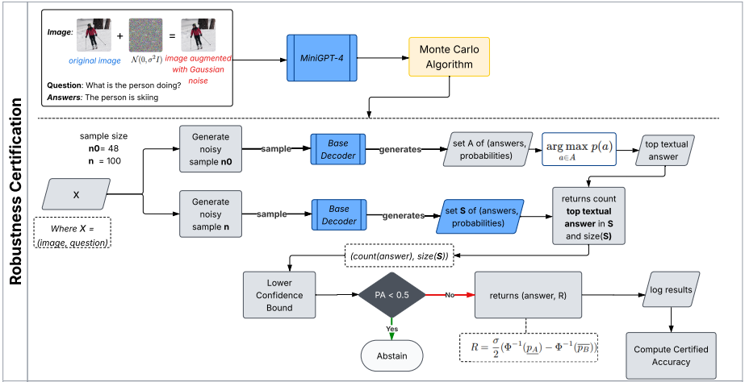
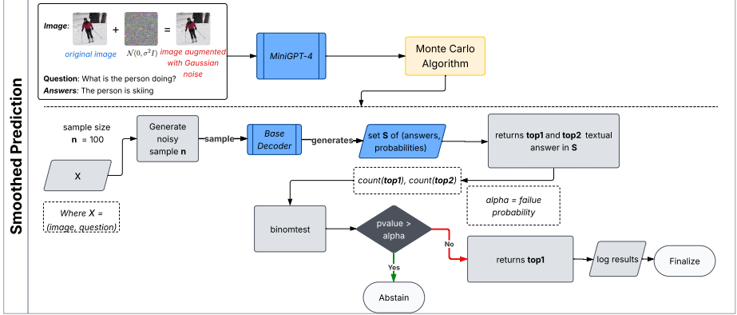
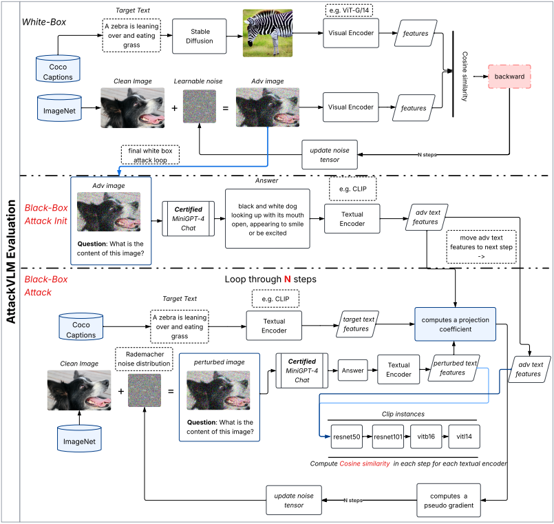
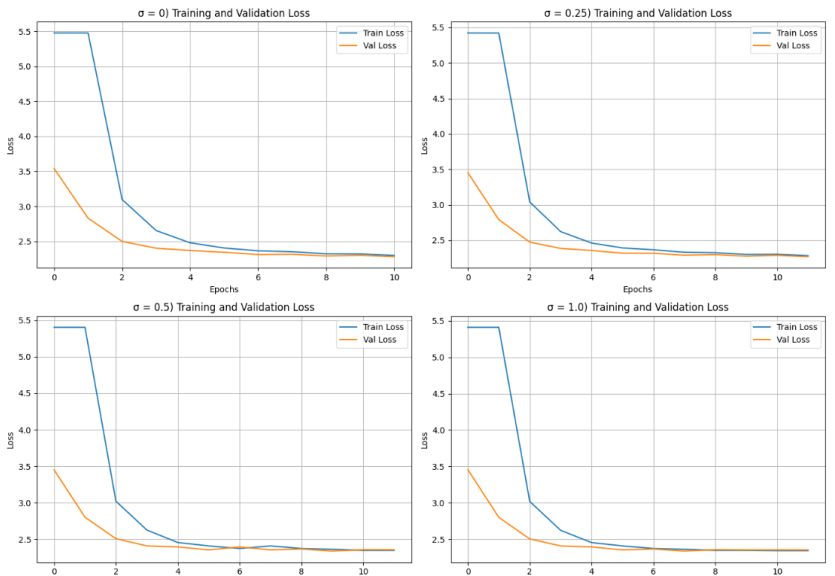

# CertifiedGPT: Adversarial Robustness Evaluation of Vision And Language Models Against Targeted Black Box Attacks

## Overview
This repository contains the code for CertifiedGPT, a pipeline to certify the adversarial robustness of multimodal vision and language model(VLM) against
visual perturbations in input images. 

In this work, we explored the concept of robustness certification in order to make a VLM robust against targeted black-box attacks through the use of a randomized smoothing technique. 

First, we fine-tuned the MiniGPT-4 model on a small subset of VQAv2 and applied Gaussian noise to the input images. We also adapted a smoothed method that encapsulates the original decoder and generates the most probable answer, even with the noise in the input images. 

Finally, we evaluated the model against targeted black-box attacks. Our certified version of MiniGPT-4, when evaluated on a small VQAv2 subset, produced statistically significant results, demonstrating that randomized smoothing is a feasible approach to certifying the robustness of VLMs, especially in scenarios where access to high-performance GPU is limited.

This work is inspired by, and builds upon, concepts from the paper [*Certified Adversarial Robustness via Randomized Smoothing*](https://arxiv.org/pdf/1902.02918) by [*Jeremy Cohen*](https://jmcohen.github.io/), Elan Rosenfeld, and [*Zico Kolter*](https://zicokolter.com/).

CertifiedGPT was Developed by Leonardo Souza under the supervision of [*Pedro Nuno de Souza Moura*](https://ppgi.uniriotec.br/professores-do-ppgi/pedro-moura/) and [*Maíra Athanázio de Cerqueira Gatti*](https://ppgi.uniriotec.br/professores-do-ppgi/mgdebayser/) from the [*The Graduate Program in Computer Science (PPGI)*](https://ppgi.uniriotec.br/) at [*UNIRIO*](https://www.unirio.br/).

## Original vs Noisy Image(σ=0.5)

The left panel shows the clean image; the right panel applies additive Gaussian noise with variance σ = 0.5, which is used during finetuning, certification, and smoothed prediction under the randomized smoothing technique. For adversarial attacks, this clean–noisy pair can initialize an iterative image-space optimization that learns a perturbation to alter a model’s output, including VLMs such as MiniGPT-4, for specified tasks. Experiments demonstrate that a VQA task can be attacked in a targeted
manner, forcing the model to produce an attacker specified answer while keeping the perturbation visually subtle.

## Key Contributions
- Certified VLM Framework: We present an adaptation of randomized smoothing certification specifically for VLMs performing VQAv2 tasks.

- Decoder-to-Label Certification: We provide a procedure that maps the MiniGPT-4 decoder’s textual outputs to discrete labels and apply the certification algorithm of
  Cohen et al. [2019] with proper confidence bounds, preserving theoretical guarantees while operating on generated answers.

- Robustness Guarantees: The certified model ensures that small, imperceptible perturbations on input images do not change the predicted answer within an ℓ2 radius
  determined by the smoothing parameters.

- Evaluation Protocol for VQA: We establish an evaluation protocol for VQA under certification that reports
  certified accuracy, coverage, and abstention over the normalized answer set, providing a reproducible setup for future studies.

- Targeted Black-Box Evaluation: We evaluate robustness under targeted black-box adversarial attacks, reporting attack success rate.

- Practical Scalability: We demonstrate a computationally feasible approach that operates with limited GPU resources.

## Research Questions
**RQ1:** What is the performance gain of incorporating robustness certification through Randomized Smoothing to a VLM predictor?

**RQ2:** To what extent does incorporating randomized smoothing improve a VLM’s empirical robustness to targeted adversarial attacks that induce predefined question outputs in a black-box setting?

## Methodology
The pipeline integrates noise-augmented fine-tuning, randomized smoothing for statistical robustness certification, and adversarial attack evaluation using both white-box and black-box strategies. Parameter choices for noise, sampling, and computational resources are explicitly reported to support experimental rigor and facilitate future validation.

The certification procedure, illustrated in the above image, consists of using a Monte Carlo to estimate the
most frequent answer (top-1), and a lower confidence bound for its probability. If this bound exceeds the certification
threshold (pA > 0.5), the robustness radius is computed as: R = σ 2 (Φ−1(pA) − Φ−1(pB)) where pB is the maximum
upper confidence bound over all competitors ctA. Otherwise, the model abstains. 

The complementary smoothed prediction procedure performs repeated noisy sampling, identifies the top-2 labels, and applies a binomial test at level α to decide between returning the top label or abstaining. 

The attack part of the pipeline, as demonstrated in the below image, summarizes the three-stage adversarial evaluation protocol. The top section illustrates white-box attack initialization, where learnable noise is optimized to match the target image features using visual encoders and cosine similarity. The middle section demonstrates black-box attack initiation using adversarial images and MiniGPT-4 certification, followed by CLIP-based feature extraction. The bottom stage presents the iterative black-box attack process, where clean images are perturbed, textual and visual features are compared across multiple backbone encoders, and attack parameters are updated over multiple steps.

### Hypotheses
In order to determine whether there is a statistically significant relationship between the variables, the ANCOVA test  is applied with the following hypotheses:

**H0 for QP2:** There is no statistically significant relationship between the application of random smoothing and the success rate of adversarial attacks.

**H1 for QP2:** There is a statistically significant relationship between the application of random smoothing and the success rate of adversarial attacks.

The main rationale for using the ANCOVA test is that it allows evaluating whether there are statistically significant differences between groups, which applies to this research, whose objective is to assess the performance of the certified model under different noise levels and in the presence of adversarial attacks conducted by different backbones (e.g., ViT/16 and ViT/32).

## Empirical findings

Regularized learning curves: training and validation loss across epochs for Gaussian noise levels σ ∈ {0, 0.25, 0.5, 1.0} show rapid convergenceand closely tracked reduction in error, indicating improved generalization with moderate noise and minimal overfitting across settings.

### VQA performance
Overall accuracy and category-wise scores (Yes/No, Number, Other) for noise levels
σ ∈ 0, 0.25, 0.5, 1.0, showing an initial drop at 0.25 and partial recovery at higher σ

| Noise Level | Overall | Yes/No | Number | Other |
|-------------|---------|--------|--------|--------|
| **0**       | 32.39   | 48.17  | 23.44  | 21.70 |
| **0.25**    | 27.84   | 38.44  | 17.71  | 21.70 |
| **0.5**     | 29.04   | 42.26  | 26.56  | 18.82 |
| **1.0**     | 29.86   | 42.74  | 27.60  | 19.87 |

### Certification Results
Certified and standard accuracy across ℓ2 radius for the proposed VQA randomized smoothing setup. For each target radius r, the table reports the best-performing noise level σ (among the evaluated values) and the corresponding certified top-1 accuracy, alongside the standard (r = 0) accuracy for the same σ. Results illustrate the expected trade-off, where larger σ yields stronger guarantees at higher radius while potentially affecting natural accuracy

| ℓ₂ radius | Best σ | Cert. Acc (%) | Std. Acc (%) |
|-----------|--------|----------------|---------------|
| **0.5**   | 1.00   | 35.0           | 38.0          |
| **1.0**   | 1.00   | 33.0           | 38.0          |
| **2.0**   | 0.25   | 25.0           | 41.0          |
| **3.0**   | 0.25   | 25.0           | 41.0          |

### Adversarial Attacks
Targeted black-box attack success rates (lower is better) for AttackVLM evaluated on MiniGPT-4 fine-tuned with different
Gaussian noise levels (σ) under the randomized smoothing setup. Lower values indicate greater adversarial robustness.

| Backbone   | σ = 0 | σ = 0.25 | σ = 0.5 | σ = 1.0 |
|------------|-------|----------|---------|---------|
| **RN50**   | 0.585 | 0.583    | 0.579   | 0.579   |
| **RN101**  | 0.562 | 0.554    | 0.551   | 0.552   |
| **ViT-B/16** | 0.595 | 0.587  | 0.583   | 0.581   |
| **ViT-B/32** | 0.620 | 0.623  | 0.620   | 0.620   |
| **ViT-L/14** | 0.470 | 0.454  | 0.449   | 0.448   |

## Hypothesis Evaluation

Statistics of the coefficients estimated by the ANCOVA hypothesis test. Positive coefficients are associated with attack success rates (greater vulnerability). Negative relationships indicate a lower attack success rate as noise level increases.

|                                         | coef    | z        | P>&#124;z&#124; | [0.025, 0.975]        |
|-----------------------------------------|---------|----------|-----------------|------------------------|
| Backbone[T.RN101] (Intercept)           | **0.5581**  | 719.131  | **0.000**           | [0.557, 0.560]         |
| Backbone[T.RN50]                        | 0.0255  | 17.410   | 0.000           | [0.023, 0.028]         |
| Backbone[T.ViT-B/16]                    | 0.0358  | 28.222   | 0.000           | [0.033, 0.038]         |
| Backbone[T.ViT-B/32]                    | 0.0637  | 73.421   | 0.000           | [0.062, 0.065]         |
| Backbone[T.ViT-L/14]                    | -0.0945 | -87.413  | 0.000           | [-0.097, -0.092]       |
| CoefNoiseLevel:Backbone[T.RN101]        | **-0.0080** | -7.256   | **0.000**           | [-0.010, -0.006]       |
| CoefNoiseLevel:Backbone[T.RN50]         | 0.0026  | 1.492    | 0.136           | [0.001, 0.006]         |
| CoefNoiseLevel:Backbone[T.ViT-B/16]     | -0.0066 | -2.669   | 0.008           | [-0.011, -0.002]       |
| CoefNoiseLevel:Backbone[T.ViT-B/32]     | 0.0067  | 4.732    | 0.000           | [0.004, 0.010]         |
| CoefNoiseLevel:Backbone[T.ViT-L/14]     | -0.0108 | -6.221   | 0.000           | [-0.014, -0.007]       |

Statistics of the coefficients estimated by the ANCOVA hypothesis test. Positive coefficients are associated with attack success rates (greater vulnerability), while negative values, such as observed in the ViT-L/14 backbone, indicate a lower attack success rate under smoothing (noise). Additionally, it is noted that the RN101 backbone, despite serving as the reference, suffers a considerable drop in attack success rate as the noise level increases.

|                                              | coef    | P>&#124;z&#124; | [0.025, 0.975]         |
|----------------------------------------------|---------|-----------------|--------------------------|
| Backbone[T.RN101] (Intercept)                | **0.5613** | **0.000**       | [0.560, 0.563]           |
| Backbone[T.RN50]                             | 0.0222  | 0.000           | [0.018, 0.026]           |
| Backbone[T.ViT-B/16]                         | 0.0357  | 0.000           | [0.033, 0.038]           |
| Backbone[T.ViT-B/32]                         | 0.0590  | 0.000           | [0.058, 0.060]           |
| Backbone[T.ViT-L/14]                         | -0.0915 | 0.000           | [-0.093, -0.090]         |
| CoefSmoothing:Backbone[T.RN101]             | **-0.0090** | **0.000**       | [-0.010, -0.008]         |
| CoefSmoothing:Backbone[T.RN50]              | 0.0059  | 0.005           | [0.002, 0.010]           |
| CoefSmoothing:Backbone[T.ViT-B/16]          | -0.0037 | 0.019           | [-0.007, -0.001]         |
| CoefSmoothing:Backbone[T.ViT-B/32]          | 0.0101  | 0.000           | [0.009, 0.011]           |
| CoefSmoothing:Backbone[T.ViT-L/14]          | -0.0103 | 0.000           | [-0.012, -0.009]         |

In summary, the results presented provide sufficient empirical evidence to reject the null hypothesis (H0) and accept the alternative hypothesis H1 for QP2: There is a statistically significant relationship between the application of random smoothing and the success rate of adversarial attacks for at least one of the groups. Although the attacks were conducted with reduced hyperparameters due to limited access to high-performance GPUs, the results demonstrate that, statistically, both noise and the presence of random smoothing contribute to mitigating the success of the attacks.

## Dataset
https://huggingface.co/LeoSouza/certifiedgpt/tree/main
...
## License
This repository is under [BSD 3-Clause License](Licences/LICENSE.md).
Many codes are based on [MiniGPT4](https://github.com/Vision-CAIR/MiniGPT-4) with 
BSD 3-Clause License [here](Licences/LICENSE_MiniGPT-4.md).

## Project Status
This research is associated with a master's dissertation defended at UNIRIO in 2025. The official version of the dissertation will be made available on the UNIRIO institutional digital library and the Sucupira Platform once the publication process is complete. The corresponding research article has been submitted for peer review but is not yet published.

